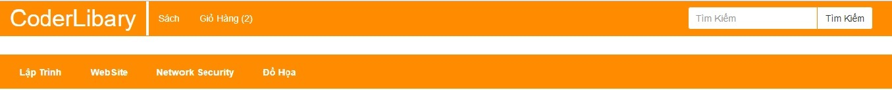
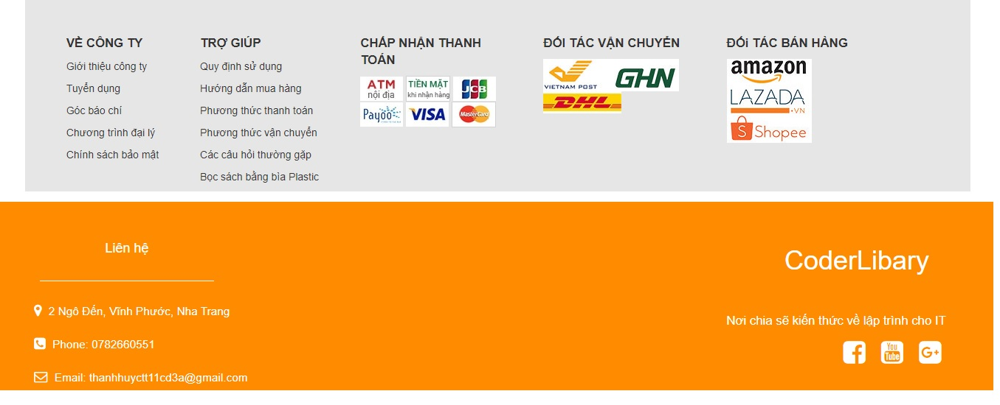
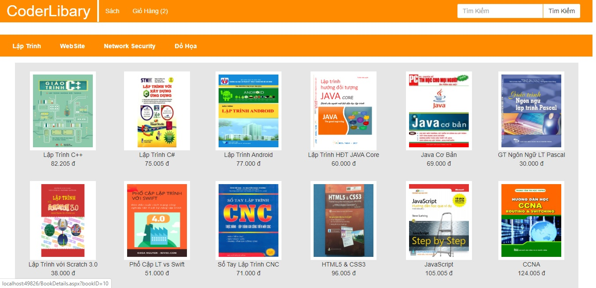
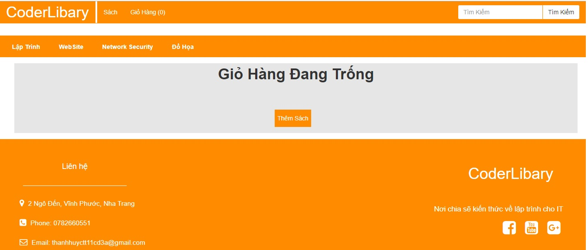
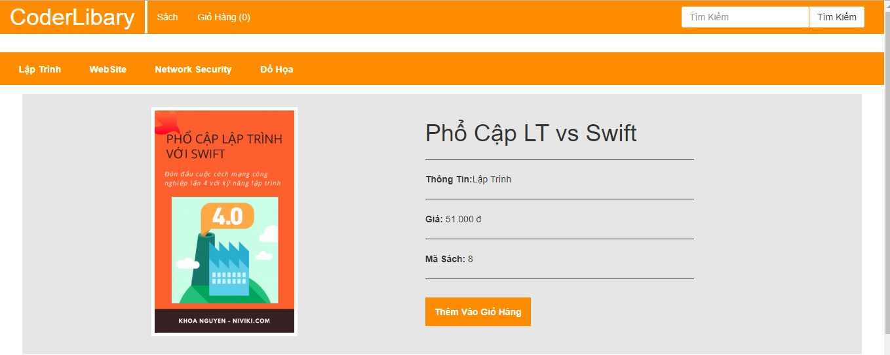
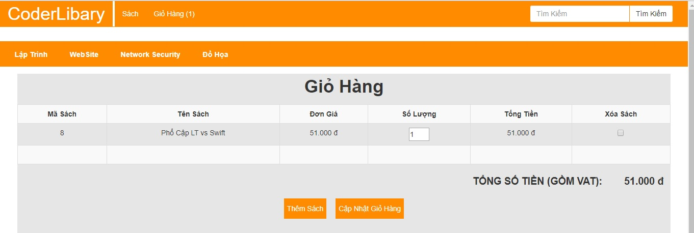
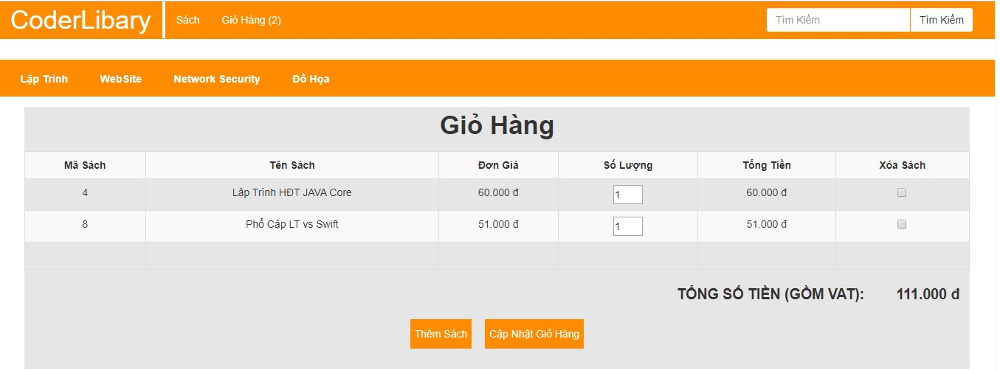
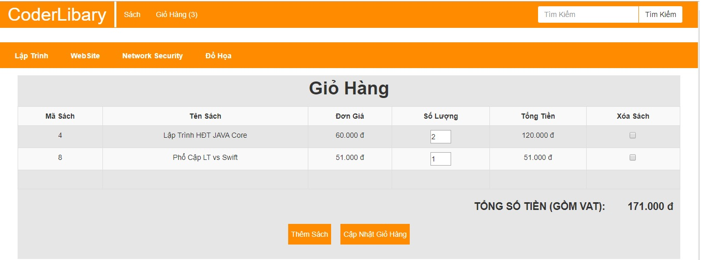
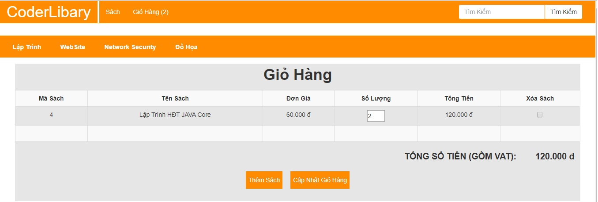

# WebSite Thương Mại CoderLibary

* WebSite CoderLibary được xây dựng bằng ASP.NET, là WebSite bán hàng về các mặt hàng về Sách và đa số là sách về ngành Công Nghệ Thông Tin. 
* Và sau đây tôi sẽ trình bày cấu trúc WebSite CoderLibary.
* WebSite CoderLibary gồm 3 trang chính là Trang Chủ, Sách và Giỏ Hàng.

* Trang Chủ chứa các slide ảnh và một số thông tin như về công ty, các phương thức thanh toán, các phương thức vận chuyển...vv

* Trang Sách chứa các loại sách, mỗi sách có thông tin về sách như hình ảnh, tên sách và giá tiền. 

* Hiện tại trang Giỏ Hàng vẫn trống, và một nút "Thêm Sách". Khi click vào nút "Thêm Sách" sẽ đưa người dùng qua trang Sách. 

* Khi click vào bất kì 1 cuốn sách trong trang Sách sẽ đưa người dùng qua một trang chi tiết về cuốn sách đó và có nút "Thêm vào Giỏ Hàng". 

* Click vào nút "Thêm vào Giỏ Hàng" sẽ đưa người dùng qua trang Giở Hàng và giờ trang Giở Hàng sẽ như hình dưới. 

* Nếu người dùng muốn mua nhiều cuốn sách thì click vào nút "Thêm Sách" và quá trình như những bước trên đã thực hiện. 

* Người dùng muốn mua một cuốn sách với số lượng nhiều bằng cách thay đổi số tại cột số lượng và click vào nút "Cập Nhật Giỏ Hàng".

* Và người dùng muốn xóa sách khi đã chọn thì người dùng sẽ tích vào sách muốn xóa ở cột Xóa Sách và cuối cùng là click vào nut "Cập Nhật Giỏ Hàng".

